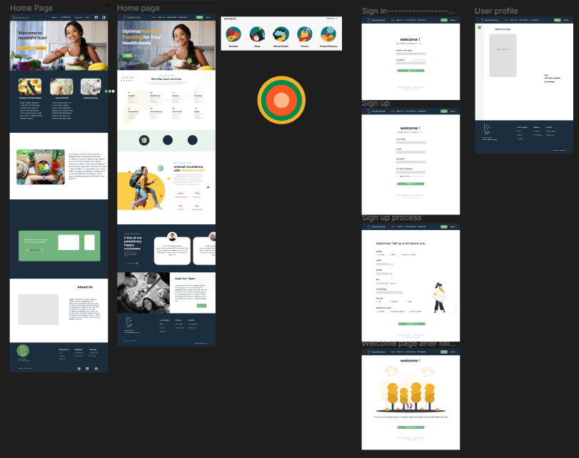

# Team Name: Wellness Whimsy Wizards

**Group Number:** 9

**Web Application Name:** Health Fuel Hub

**Description of Application:** Health Fuel Hub is a web application that is used to keep track of the amount of calories that users eat. Users can input the type and amount of food they have consumed into the application calculator. The calculator will then tell the user the total amount of calories they have consumed. Ads will be used to generate revenue and paid accounts will have additional features and no ads. Free accounts will be used to track their specific calorie consumption.

**Screenshot of Page Layouts:**

**What features are done:**

- Layout of desktop pages
- Logo finalized
- Site Map of pages
- Content on pages

**What features are not done:**
 
- Adding HTML content to all pages
- Designing Mobile layouts
- Creating Calorie Counter
- Adding User Accounts

**Definition of Done:** 
The element has been written, reviewed by at least 1 other team member, edited if needed and fully integrated into the branch above it (usually main) and no new errors are introduced.

**Product Goal:** 
For our Product Goal, Health Fuel Hub is a web app that will allow clients to track their daily calorie intake. Clients will be able to sign up or login to track the type and amount of food that they have consumed which they would input. Then the application will be able to tell them how many calories they have eaten. Also, when signing up, they will be able to see ads that will be monetized and as well as see paid accounts on the web app.

